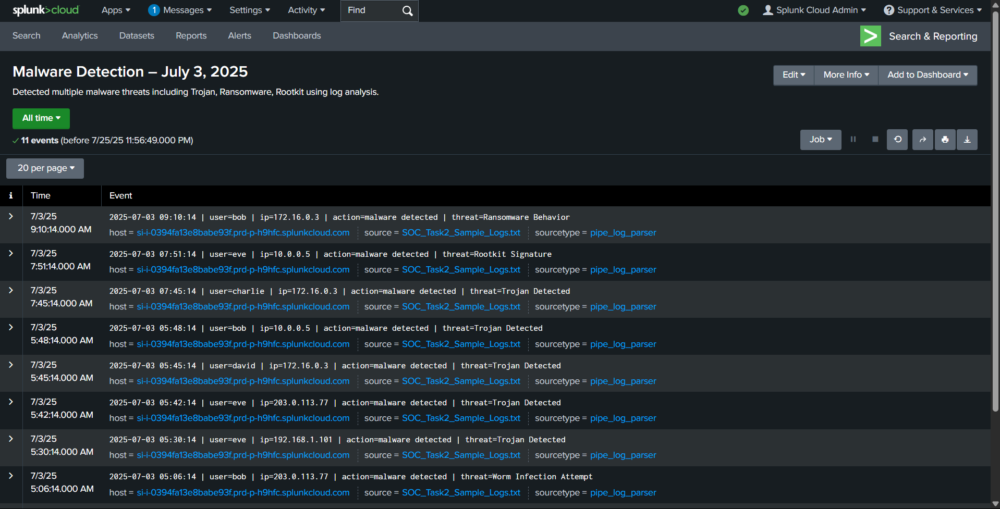

# FUTURE_CS_02 – SOC Task 2: Security Alert Monitoring & Incident Response

This repository contains my work for **Task 2** of my cybersecurity internship.  
The objective was to analyze simulated security logs using a SIEM tool (Splunk Cloud), detect suspicious activity, classify incidents, and generate a report with recommendations.

---

## 🧠 What I Did

- Used **Splunk Cloud** to ingest and analyze structured `.txt` log data
- Wrote custom SPL queries to detect security incidents
- Identified and classified multiple malware threats (Trojan, Ransomware, Rootkit, etc.)
- Created an incident response report detailing the findings
- Recommended remediation actions based on the alerts

---

## 📁 Files in This Repo

| File | Description |
|------|-------------|
| `SOC_Task2_Sample_Logs.txt` | The sample log file uploaded to Splunk |
| `incident_report.md` | Full incident response report with findings and recommendations |
| `malware_search_screenshot.png` | Screenshot showing malware detection in Splunk |

---

## 🧾 Sample SPL Query Used

```spl
index=main "malware detected"
```

I also used `rex` to extract fields like `user`, `ip`, `action`, and `threat` to support analysis.

---

## 📸 Preview



---

## ✅ Skills Gained

- SIEM operation (Splunk)
- Writing and executing SPL queries
- Field extraction using regex (`rex`)
- Log analysis and threat detection
- Writing a professional incident response report

---

## 🔗 Connect With Me

[LinkedIn – Abhinav Dwivedi](https://www.linkedin.com/in/abhinav-dwivedi-384b38188/)
